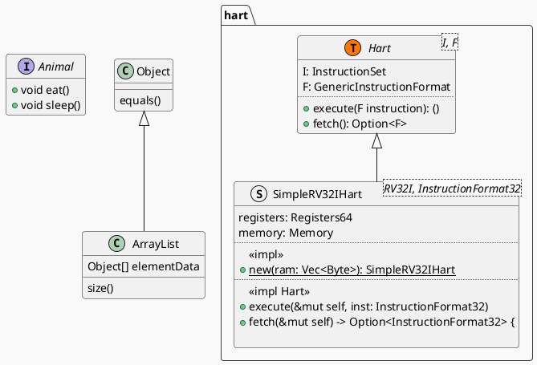

# Class Diagram

```plantuml
@startuml

!theme mars
skinparam defaultFontName "Envy Code R"
skinparam defaultFontSize 14

!$trait = "<< (T, #FF7700) >>"
!define trait $trait

package hart {
    struct SimpleRV32IHart<RV32I, InstructionFormat32> extends Hart {
        registers: Registers64
        memory: Memory
        ..
        <<impl>>
        + {static} new(ram: Vec<Byte>): SimpleRV32IHart
        ..
        <<impl Hart>>
        + execute(&mut self, inst: InstructionFormat32)
        + fetch(&mut self) -> Option<InstructionFormat32> {
        
    }

    interface Hart<I, F> $trait {
        I: InstructionSet
        F: GenericInstructionFormat
        ..
        + execute(F instruction): ()
        + fetch(): Option<F>
    }
    
}


interface Animal <<trait>> {
    + String name
    + int age
    + void eat()
    + void sleep()
}

Object <|-- ArrayList
Object : equals()
ArrayList : Object[] elementData
ArrayList : size()

hide interface fields
hide interface empty methods

@enduml
```
